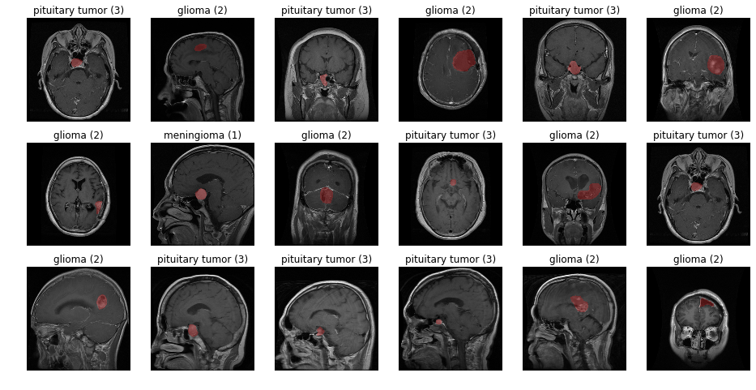

# Brain-Image-Segmentation
Brain tumor segmentation using a 3D UNet CNN

I used Keras with a Tensorflow backend. This UNet was built for the following dataset: https://figshare.com/articles/brain_tumor_dataset/1512427

3064 T1-weighted contrast-inhanced images with three kinds of brain tumor are provided in the dataset.

The first half of the U-net is effectively a typical convolutional neural network like one would construct for an image classification task, with successive rounds of zero-padded ReLU-activated convolutions and ReLU-activated max-pooling layers. Instead of classification occurring at the "bottom" of the U, symmetrical upsampling and convolution layers are used to bring the pixel-wise prediction layer back to the original dimensions of the input image.

Here is the architecture for the 2D U-Net from the original publication mentioned earlier:

### Visualization of the dataset

[Notebook](Data-Visualization) to visualize:
- the repartition of classes
- the 2D slices with the tumor mask
- the tumors

### Model 

[Notebook](Model) to visualize:
-Building the U-Net architecture
-Fitting the model
-Evaluate Model
-Make Prediction

Here's an example of the correlation between my predictions in a single 2D plane:

Ground Truth:               |  Prediction:
:-------------------------:|:-------------------------:
  |  

Here's an example of the correlation between my predictions in a rotating 3D volume plane:

Ground Truth:               |  Prediction:
:-------------------------:|:-------------------------:
  |  

Tips for improving model:

-The feature maps have been reduced so that the model will train using under 12GB of memory. If you have more memory to use, consider increasing the feature maps this will increase the complexity of the model (which will also increase its memory footprint but decrease its execution speed).
-If you choose a subset with larger tensors (e.g. liver or lung), it is recommended to add another maxpooling level (and corresponding upsampling) to the U-Net model. This will of course increase the memory requirements and decrease execution speed, but should give better results because it considers an additional recepetive field/spatial size.
-Consider different loss functions. The default loss function here is a binary_crossentropy. Different loss functions yield different loss curves and may result in better accuracy. However, you may need to adjust the learning_rate and number of epochs to train as you experiment with different loss functions. 
-Try exceuting other U-Net architectures in the model folders.

The UNet was based on this paper: https://arxiv.org/abs/1802.10508

I heavily modified code from the following sources to get this project to work:

- Original code for building the UNet was from this repo: https://github.com/ellisdg/3DUnetCNN

